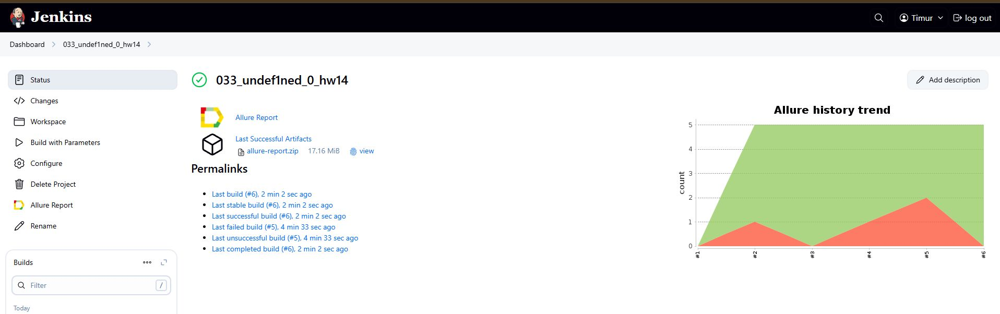
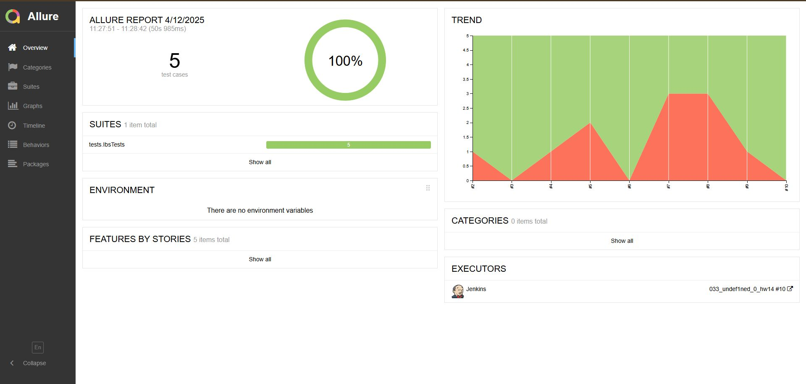
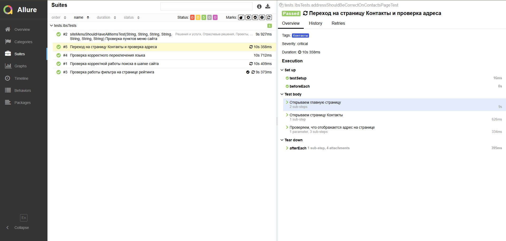
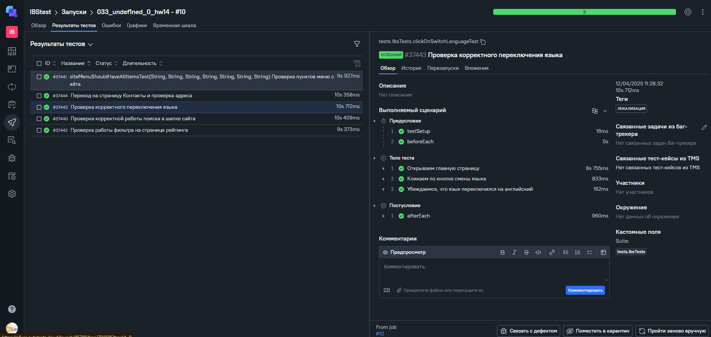
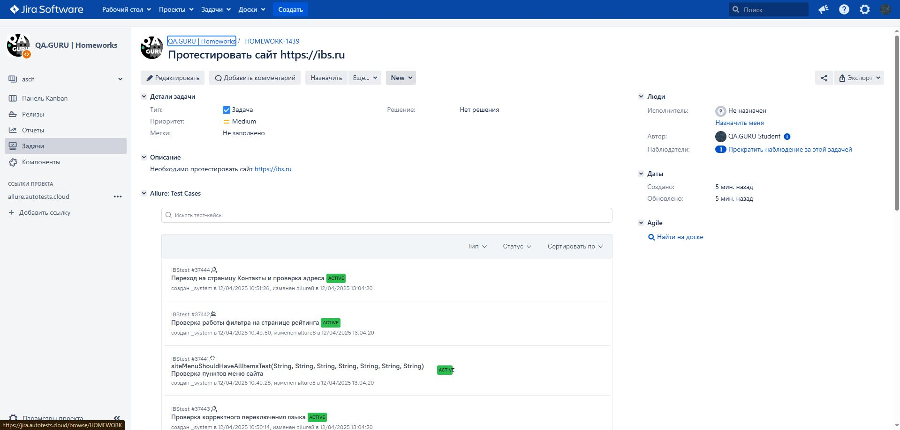
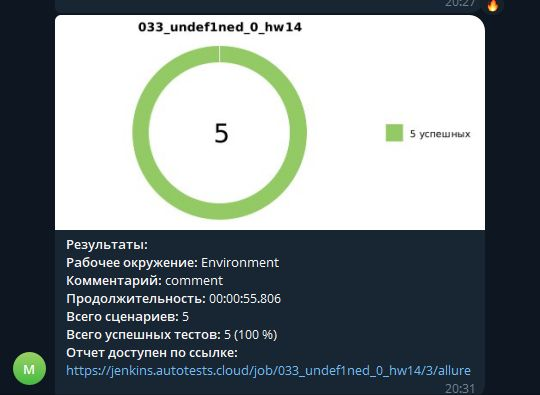
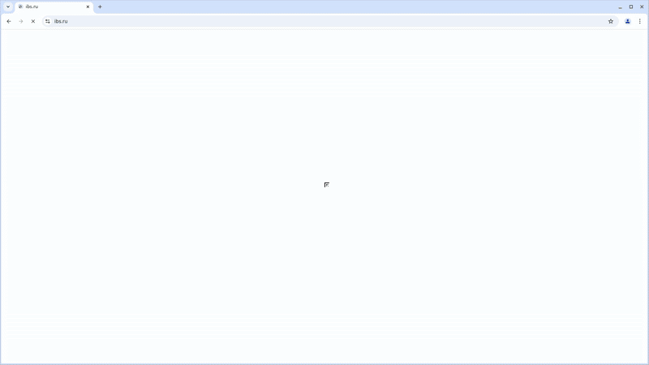

# Проект по автоматизации тестирования для компании [IBS Group](https://ibs.ru/)
____

> IBS — одна из крупнейших российских IT-компаний. Направления деятельности — консалтинг, внедрение бизнес-приложений, IT-аутсорсинг и разработка ПО.

## Содержание:
___

- <a href="#tools">Технологии и инструменты</a>
- <a href="#cases">Примеры автоматизированных тест-кейсов</a>
- <a href="#jenkins">Сборка в Jenkins</a>
- - <a href="#jenkins-params">Параметры сборки в Jenkins</a> 
- - <a href="#commands">Команды для запуска из терминала</a> 
- <a href="#allure">Allure Report</a>
- - <a href="#allure-report">Основная страница отчета</a>
- - <a href="#allure-cases">Тест-кейсы</a>
- <a href="#testops">Интеграция с Allure TestOps</a>
- <a href="#jira">Интеграция с JIRA</a>
- <a href="#telegram">Уведомления в телеграм при помощи бота</a>
- <a href="#video">Примеры видео выполнения тестов на Selenoid</a>
___

<a id="tools"></a>
## Технологии и инструменты:
<p align="center">
<a href="https://www.jetbrains.com/idea/"></a>
<a href="https://www.java.com/"></a>
<a href="https://junit.org/junit5/"></a>
<a href="https://selenide.org/"></a>
<a href="https://github.com/"></a>
<a href="https://gradle.org/"></a>
<a href="https://www.jenkins.io/"></a>
<a href="https://allurereport.org/"></a>
<a href="https://qameta.io/"></a>
<a href="https://www.atlassian.com/software/jira"></a>
</p>

<a id="cases"></a>
## Примеры автоматизированных тест-кейсов:
- Проверка работы фильтра на странице рейтинга
- Проверка корректной работы поиска в шапке сайта
- Проверка корректного переключения языка
- Переход на страницу Контакты и проверка адреса
- Проверка на наличие всех разделов в меню сайта

<a id="jenkins"></a>
##  Сборка в [Jenkinks](https://jenkins.autotests.cloud/job/033_undef1ned_0_diploma23_ui)


<a id="jenkins-params"></a>
### Параметры сборки в Jenkins
- *WDHOST* (адрес удаленного сервера Selenoid)
- *BROWSER* (браузер, по умолчанию chrome)
- *BROWSER_VERSION* (версия браузера, по умолчанию 128.0)
- *BROWSER_SIZE* (размер окна браузера, по умолчанию 1920x1080)
- *LOGIN_USERNAME* (логин для удаленного сервера)
- *USER_PW* (пароль для удаленного сервера)

<a id="commands"></a>
### Команды для запуска из терминала

Локальный запуск:
```bash
gradle clean test -Denv=local
```

Удалённый запуск через Jenkins:
```bash
gradle clean test
"-Dwdhost=${WDHOST}"
"-Dbrowser=${BROWSER}"
"-Dbrowser_version=${BROWSER_VERSION}"
"-Dbrowser_size=${BROWSER_SIZE}"
"-Dpassword=${USER_PW}"
"-Dlogin=${LOGIN_USERNAME}"
```

<a id="allure"></a>
##  [Allure Report](https://jenkins.autotests.cloud/job/033_undef1ned_0_diploma23_ui/13/allure)
___
> Allure Report - Фреймворк для формирования удобных и наглядных отчетов о результатах автотестов. Помогает быстро увидеть, какие тесты упали и почему.

<a id="allure-report"></a>
### Основная страница отчета



<a id="allure-cases"></a>
### Тест-кейсы


<a id="testops"></a>
##  Интеграция с [Allure TestOps](https://allure.autotests.cloud/project/4711)
___
> Allure TestOps - платформа для управления автотестами: запуск, аналитика, отслеживание стабильности, ручные тест-кейсы и интеграция с Jira.




<a id="jira"></a>
##  Интеграция с [JIRA](https://jira.autotests.cloud/browse/HOMEWORK-1439)
___
> Jira – система трекинга задач и багов. Используется для управления проектом, привязки тест-кейсов и отображения статуса выполнения тестов через интеграцию с TestOps.
> 


<a id="telegram"></a>
##  Уведомления в телеграм при помощи бота:
___



<a id="video"></a>
##  Примеры видео выполнения тестов на Selenoid:
___
> Selenoid - инструмент для запуска браузеров в Docker-контейнерах. Позволяет параллельно и стабильно выполнять UI-тесты в разных браузерах.

